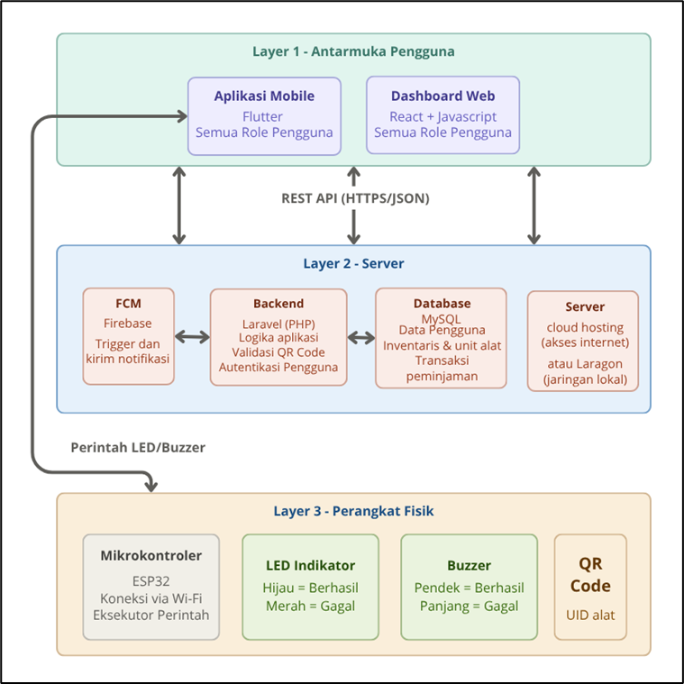
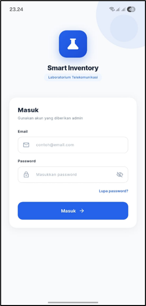
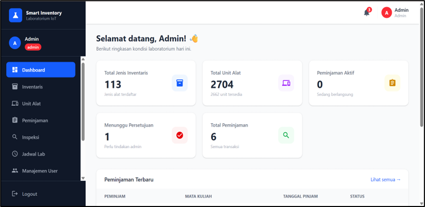
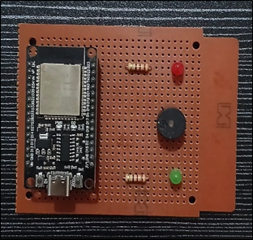

# Smart Inventory Laboratorium Telekomunikasi

Sistem inventaris pintar untuk laboratorium telekomunikasi: peminjaman alat dengan QR code, ESP32, aplikasi mobile, dan dashboard web.

## Latar Belakang

Smart Inventory adalah sistem yang saya buat sebagai Tugas Akhir untuk membantu pengelolaan inventaris dan peminjaman alat di Laboratorium Telekomunikasi. Sebelumnya pencatatan alat hanya lewat Excel dan peminjaman tidak terdokumentasi. Lewat sistem ini, alat dipindai dengan QR code, status peminjaman tercatat otomatis, dan pengguna (mahasiswa, dosen, admin lab) bisa mengaksesnya lewat aplikasi mobile maupun dashboard web.

## Fitur Utama

- Pencatatan data inventaris alat laboratorium
- Pengajuan dan pencatatan peminjaman alat
- Pemindaian QR code menggunakan perangkat ESP32 dengan indikator LED dan buzzer
- Hak akses berbasis peran (mahasiswa, dosen, admin laboratorium)
- Aplikasi mobile dan dashboard web yang bisa diakses semua peran

## Teknologi

| Bagian | Teknologi |
|---|---|
| Backend | Laravel (REST API) |
| Mobile | Flutter |
| Web Dashboard | React + TypeScript |
| Database | MySQL |
| Perangkat | ESP32 + QR code scanner |

## Arsitektur Sistem

## Tampilan Aplikasi

## Hasil

## Hasil

Sistem sudah berhasil diuji dan berjalan sesuai fungsinya. Alat yang dipindai lewat QR code langsung terbaca oleh ESP32, lalu LED dan buzzer memberi tanda apakah proses berhasil. Data peminjaman tercatat otomatis dan bisa dilihat dari aplikasi mobile maupun dashboard web, dengan tampilan yang menyesuaikan peran masing-masing pengguna (mahasiswa, dosen, atau admin lab).

Dengan sistem ini, pencatatan peminjaman tidak lagi bergantung pada Excel dan lebih mudah ditelusuri oleh admin laboratorium.

## Informasi Proyek

Tugas Akhir D4 Teknik Telekomunikasi, Politeknik Negeri Padang (2026).
Source code tidak dipublikasikan di repositori ini. Tersedia atas permintaan.

© 2026 Hanum. All rights reserved.
